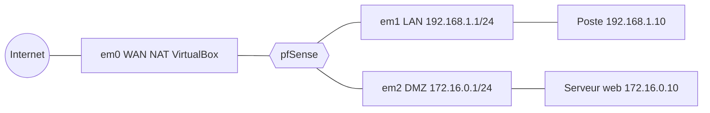

# Lab pare-feu : pfSense avec zone DMZ

> **Statut : à réaliser.** Ce guide est préparé à partir de la documentation officielle et de mes cours ; **je ne l'ai pas encore rejoué de bout en bout**. Les commandes sont à valider en le faisant, et le journal en bas de page sera complété avec mes résultats réels (captures, erreurs rencontrées, corrections).
>
> **Commandes vérifiées :** ce lab est allé plus loin que les autres : une vraie VM VirtualBox a été créée et pfSense CE 2.7.2 y a été **installé sans aucune intervention manuelle** (clavier piloté à l'aveugle par scancodes PS/2, chaque étape vérifiée par une vraie capture d'écran — voir [`verification/`](verification), 22 septembre 2026). Une fois démarré, l'interface DMZ a été activée (172.16.0.1/24), la règle « Bloque DMZ vers LAN » puis la règle « Autorise DMZ vers internet » ont été créées dans le bon ordre, et la redirection de port WAN:80 → 172.16.0.10:80 a été configurée — le tout appliqué au vrai pare-feu et prouvé par 4 captures d'écran de l'interface web authentifiée. Un blocage matériel (écran figé après le premier redémarrage) a été rencontré et corrigé par un arrêt puis un redémarrage à froid, documenté dans `verification/creer-vm.md`. Ce qui n'a pas été vérifié : aucun serveur web ne tourne réellement à 172.16.0.10 (pas de deuxième machine sur le réseau DMZ isolé), donc la redirection n'a pas été testée de bout en bout, et le mot de passe administrateur est resté la valeur par défaut. Vérifié ne veut pas dire réalisé : c'est l'assistant IA qui a préparé ce guide qui a rejoué ces commandes dans un conteneur jetable, pas moi sur mon propre lab. Le journal ci-dessous reste à remplir une fois que je l'aurai fait moi-même.

## Objectif

Construire un **pare-feu à trois zones** avec pfSense dans VirtualBox : **WAN** (internet), **LAN** (postes de l'entreprise) et **DMZ** (serveur web exposé). Appliquer le principe du moindre privilège : le LAN peut aller vers la DMZ, la DMZ ne peut **pas** revenir vers le LAN.

## Prérequis

- VirtualBox, l'image ISO de pfSense CE (téléchargée depuis le site officiel), 2 Go de RAM et 8 Go de disque pour la VM pfSense.
- Deux machines Debian (ou tout autre système) : un poste LAN et un serveur web DMZ.

## Topologie

| Zone | Carte VirtualBox | Réseau | pfSense |
|---|---|---|---|
| WAN | Carte 1 : NAT | (DHCP de VirtualBox) | DHCP |
| LAN | Carte 2 : réseau interne `lan` | 192.168.1.0/24 | 192.168.1.1 |
| DMZ | Carte 3 : réseau interne `dmz` | 172.16.0.0/24 | 172.16.0.1 |

## Étapes

1. **Créer la VM pfSense** avec trois cartes réseau (tableau ci-dessus), l'installer depuis l'ISO avec les options par défaut.
2. **Assigner les interfaces** au démarrage (WAN, LAN, puis OPT1 pour la DMZ). Par défaut, pfSense donne `192.168.1.1/24` au LAN.
3. **Se connecter à l'interface web** depuis le poste LAN (`https://192.168.1.1`), suivre l'assistant, puis **changer immédiatement le mot de passe par défaut** de l'administrateur (les identifiants par défaut de pfSense sont connus de tous).
4. **Activer et renommer OPT1 en DMZ** : *Interfaces → Assignments → OPT1* : activer, adresse IPv4 statique `172.16.0.1/24`.
5. **DHCP** : *Services → DHCP Server* : une plage pour le LAN (par exemple `.100` à `.200`) et, si besoin, pour la DMZ.
6. **Règles de pare-feu** (*Firewall → Rules*) — pfSense **refuse tout par défaut** sur les interfaces autres que le LAN :
   - **LAN** : autoriser vers n'importe où (règle par défaut), ou seulement HTTP/HTTPS/DNS pour un durcissement.
   - **DMZ** : d'abord un **blocage** vers le réseau LAN (`Destination : LAN subnets`, action *Block*), puis une autorisation vers *any* (accès internet pour les mises à jour). L'ordre compte : une règle est évaluée du haut vers le bas.
7. **Redirection de port** (*Firewall → NAT → Port Forward*) : trafic entrant WAN sur le port 80 → `172.16.0.10:80` (serveur web), avec la règle de pare-feu associée créée automatiquement.
8. **Serveur web DMZ** : installer nginx (`apt install nginx`) avec l'adresse `172.16.0.10/24` et pour passerelle `172.16.0.1`.

## Vérifications

| Test | Résultat attendu |
|---|---|
| Depuis le poste LAN : `curl http://172.16.0.10` | la page du serveur s'affiche |
| Depuis le serveur DMZ : `ping 192.168.1.10` | **échec** (bloqué) |
| Depuis le serveur DMZ : `ping 1.1.1.1` | réponse (si autorisé) |
| Depuis le poste LAN : `ping 1.1.1.1` | réponse |
| *Status → System Logs → Firewall* | les paquets bloqués de la DMZ vers le LAN apparaissent |
| Depuis l'hôte VirtualBox : accès à la page du serveur via la redirection | la page s'affiche (selon la configuration réseau de VirtualBox) |

Compléter avec un scan depuis le poste LAN et depuis le serveur DMZ pour comparer ce que chaque zone voit : voir [nmap-audit-reseau-local](https://github.com/mehdiseg/nmap-audit-reseau-local).

## Pièges fréquents

- Cartes VirtualBox dans le mauvais mode (le LAN et la DMZ doivent être des **réseaux internes** distincts).
- Le poste LAN ne peut pas ouvrir l'interface web : par défaut, elle n'est accessible que depuis le LAN.
- Règle « Block DMZ → LAN » placée **après** la règle « autoriser vers any » : elle ne sert à rien.
- Réseaux privés WAN bloqués : sur un WAN en réseau privé (VirtualBox NAT), décocher *Block private networks* dans les propriétés de l'interface WAN si le réseau du labo en dépend.

## Pour aller plus loin

- Ajouter des **VLAN** sur l'interface LAN (*Interfaces → Assignments → VLANs*) et un switch géré.
- Installer un **VPN** (OpenVPN ou WireGuard) sur pfSense : [wireguard-generateur-config](https://github.com/mehdiseg/wireguard-generateur-config).
- Exporter les journaux du pare-feu vers un serveur syslog et les analyser.

## Références

- [Documentation de pfSense](https://docs.netgate.com/pfsense/en/latest/)
- [Téléchargement de pfSense](https://www.pfsense.org/download/)

## Journal de réalisation

_Lab pas encore réalisé : cette section sera remplie au fur et à mesure._

| Date | Ce que j'ai fait | Résultat | Difficultés et solutions |
|---|---|---|---|
|  |  |  |  |

## Feuille de route

Ce lab fait partie de ma [feuille de route réseau](https://github.com/mehdiseg/roadmap-reseau-bts-sio).

## Licence

[MIT](LICENSE)
